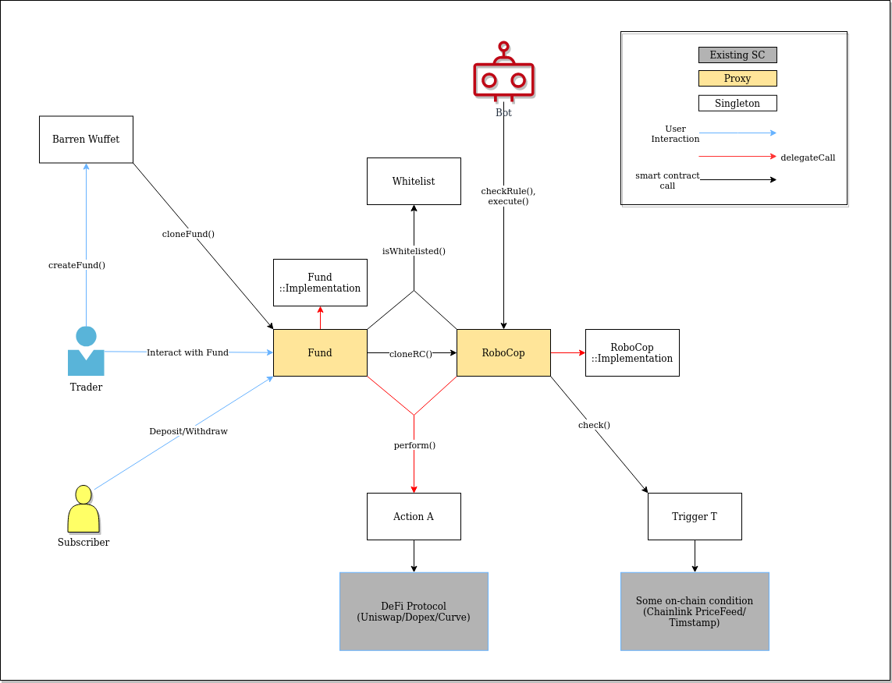

# Architecure

## Barren Wuffet

This contract allows anyone to create a `Fund` with custom parameters. Fund Manager is supposed to interact with the `Fund` contract directly from here on out.

The newly created `Fund` is a proxy pointing to a singleton `FundImplementaution` deployed on chain. This is done using the [`clone()` functionality of ERC1167](https://blog.openzeppelin.com/workshop-recap-cheap-contract-deployment-through-clones/)

## Fund

Subscribers to the fund can deposit their ETH before `subscriptionConstraints.deadline`, given they pass the other capital constraints set by the manager at the time of creation.

Subscribers can withdraw their collateral before the fund is deployed, or take out their share of the assets remaining in the fund (minus management fees specified as `rewardPercentage`) after `subscriptionConstraints.lockin`. Note that this only applies to ERC20 tokens and ETH, as NFTs are not divisible. See the section on `Position` to understand how we deal with this edge case.

Fund Manager can take Actions (Whitelisted only), or setup IFTTT using its own RocoCop (ERC1167 proxy again).

Fund Manager can withdraw their fees after `lockin`, given they have have closed all active Positions.

## RoboCop

RoboCop is an on-chain IFTTT engine. The basic unit of work in the RoboCop is a rule, which is made of Triggers and Actions. RoboCop allows anyone (typically mev bots, Gelato bots or even Chainlink keepers) to call the contract to execute action on behalf of the user if a certain trigger is met. The bot can get a reward if the rule gets executed successfully.

If more than 1 Trigger is specified in a rule, all of these must pass before any action is taken (AND). If more than 1 Action is specified in a Rule, all of them will be executed sequentially (outputs of A is inputs of A+1).

### WhitelistService

For now, both Triggers and Actions have a whitelist (maintained by `WhitelistService` contract) to reduce the attack surface. The eventual goal is to allow anyone to add new triggers and actions (following the ITrigger and IAction interfaces) so they can make custom rules for automating arbitrary Ops

### Triggers

Triggers follow the ITrigger interface.

When creating rules, the triggers must return `true` when `validate()` is called to ensure the parameters given make sense for the particular trigger.

Triggers return `true` or `false` when `check()` is called. It also returns `TriggerReturn`(consisting of Type and Bytes), which may be decoded and used by other parts of the code that are trigger-aware.

Each Trigger is a singleton on-chain.

Example Triggers are:

- Chainlink price feeds
- Timestamp triggers (rough estimate only)

### Actions

Actions follow the IAction interface and **must not include any storage state**.

When creating rules, the action must return `true` when `validate()` is called to ensure the parameters given make sense for the particular action.

The `perform()` function is called on an action via a `delegateCall` (which is why they can't use storage). This returns `ActionResponse` which consists of output `Tokens` (ERC20 / ETH / ERC721) and `Positions` (more on this later).

Example Actions include defi transactions (swaps, providing liquidity, buying options).

### Positions

Some Actions are straightforward and one-shot give and take. For example, give uniswap X amount of Token A and it will return Y amount of Token B.
However, some Actions are more complicated and require something akin to a `close()` operation. For example, if you LP on uniswap, you get an NFT that you have to return to get your initial capital back (and you can collect LP rewards as long as you hold the NFT).
Furthermore, some actions can be `closed()` in multiple ways. To capture this workflow, Actions return `Position` (which is a list of possible Actions that one might take to close the position created by the initial Action).
